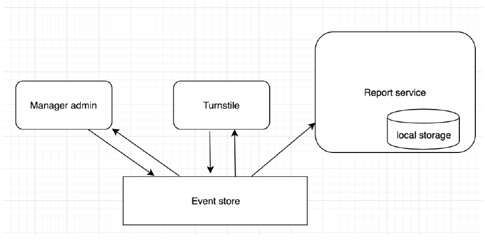

# Software Design ITMO

## Лабораторная 1.1.

### Цель: получить практический опыт применения динамических проверок в коде (assertions).

Необходимо реализовать структуры данных LRUCache на хешмапе и двусвязном списке.  
При реализации необходимо самостоятельно продумать возможные проверки pre/post-условий и инвариантов класса.  
Придуманные проверки необходимо добавить в код реализации в виде assertions.   
Класс необходимо покрыть тестами.

**Указания:**
-	использовать LinkedHashMap напрямую нельзя

### [Результат](lru-cache)

---

## Лабораторная 1.2.

### Цель: получить практический опыт реализация модульных тестов и тестов, использующих mock-объекты.

Необходимо реализовать компонент, который будет вычислять частоту появления твитов с определенным хештегом за последние несколько часов.  
Для выполнения лабораторной необходимо использовать twitter api (https://dev.twitter.com/rest/public/search) или api любой другой социальной сети (например, vk не требует авторизации).  
На входе компонент должен принимать:
-	хештег, по которому будет идти поиск
-	N - число часов, за которые необходимо построить диаграмму твитов (1 <= N <= 24). 

На выходе нужно выдать массив из N целых чисел - каждое число в массиве определяет число твитов в соответствующий час.

**Указания:**
-	при выполнении лабораторной рекомендуется применять SOLID-принципы;
-	код должен быть покрыт тестами (в том числе mock-тестами и тестами с StubServer)

**Примеры из лекции:**
https://github.com/akirakozov/example-apps/tree/master/java/mock-example

### [Результат](vk-api)

---

## Лабораторная 1.3.

### Цель: получить практический опыт применения техник рефакторинга.

Скачайте приложение: https://github.com/akirakozov/software-design/tree/master/java/refactoring. 
Приложение представляет собой простой web-server, который хранит информацию о товарах и их цене.  
Поддержаны такие методы:
-	http://localhost:8081/get-products - посмотреть все товары в базе
-	http://localhost:8081/add-product?name=iphone6&price=300 - добавить новый товар
-	http://localhost:8081/query?command=sum - выполнить некоторый запрос с данными в базе

Необходимо отрефакторить этот код (логика методов не должна измениться), например:
-	убрать дублирование
-	выделить отдельный слой работы с БД
-	выделить отдельный слой формирования html-ответа
-	и тд

**Указания:**
-	сначала добавить тесты (отдельными комитами)
-	каждый отдельный рефакторинг делать отдельным комитом

### [Результат](refactoring)

---

## Лабораторная 1.4.

### Цель: получить практический опыт применения паттерна MVC (Model-View-Controller).

Напишите небольшое веб-приложение для работы со списками дел.   
Приложение должно позволять:
- Просматривать списки дел и дела в них 
- добавлять/удалять списки дел
- добавлять дела
- отмечать дела, как выполненные

**Рекомендации:**
- использовать spring mvc
- использовать средства spring-framework для DI (dependency injection) 

Пример, который был рассмотрен на лекции: https://github.com/akirakozov/software-design/tree/master/java/mvc

### [Результат](mvc-todo-list)

---

## Лабораторная 1.5.

### Цель: получить практический опыт применения структурного паттерна bridge.

Необходимо реализовать простой визуализатор графов, используя два различных графических API.  
Способ визуализации графа можно выбрать самостоятельно (например, рисовать вершины по кругу).  
Приложение должно поддерживать две реализации графов: на списках ребер и матрице смежностей.  
Каркас классов:
```java
public abstract class Graph {    
  /**     
   * Bridge to drawing api     
   */   
  private DrawingApi drawingApi;    
  public Graph(DrawingApi drawingApi) {        
    this.drawingApi = drawingApi;    
  }    
  public abstract void drawGraph();
}
```

```java
public interface DrawingApi {    
  long getDrawingAreaWidth();    
  long getDrawingAreaHeight();    
  void drawCircle(...);    
  void drawLine(...);
}
```

**Примечания:**
-	выбор API и реализации графа должны задаваться через аргументы командной строки при запуске приложения; 
-	каркас классов можно менять (добавлять новые поля/методы, параметры методов и тд);
-	в качестве drawing api можно использовать java.awt и javafx (примеры: https://github.com/akirakozov/software-design/tree/master/java/graphics/);
-	можно использовать любой язык и любые api для рисования (главное, чтобы они были принципиально разные).

### [Результат](graphics-bridge)

---

## Лабораторная 1.6.

### Цель: получить практический опыт применения паттернов поведения visitor и state.

Необходимо реализовать калькулятор, который умеет преобразовывать простые арифметические выражения в обратную польскую запись (ОПЗ) и вычислять их.  
Пример выражения:`(23 + 10) * 5 – 3 * (32 + 5) * (10 – 4 * 5) + 8 / 2.`. 
Выражение может содержать скобки, пробельные символы, цифры и 4 операции: `+`, `-`, `*`, `/`.    
Для вычисления выражения его необходимо сначала разбить на токены:
- по одному токену на каждую скобку и операцию;
- токен для целых чисел.

Пример: `(30 + 2) / 8` -> `LEFT NUMBER(30) PLUS NUMBER(2) RIGHT DIV NUMBER(8)`.   
Далее токены преобразуются к ОПЗ, которая уже не содержит скобок и может быть легко вычислена с помощью стека.  
`LEFT NUMBER(30) PLUS NUMBER(2) RIGHT DIV NUMBER(8)` -> `NUMBER(30) NUMBER(2) PLUS NUMBER(8) DIV`.  
Схема работы калькулятора:
- входной набор данных разбирается на отдельные токены Tokenizer'ом;
- ParserVisitor обходит все полученные токены и преобразует их к обратной польской записи;
- затем токены печатаются PrintVisitor'ом;
- значение выражения вычисляется СalcVisitor'ом.

Visitor'ы могут использовать стеки и другие структуры данных, чтобы накапливать в себе промежуточные результаты.  
Tokenizer проще всего реализовать в виде конечного автомата, который считывает по одному из символов из входного потока и преобразует их в токены.   
Сам автомат необходимо реализовать, используя паттерн State.   
Схема автомата:
1. Скелет классов:
```java
interface Token {
    void accept(TokenVisitor visitor);
}
```
```java
interface TokenVisitor {
    void visit(NumberToken token);
    void visit(Brace token);
    void visit(Operation token);
}
```
2. `NumberToken`, `Brace`, `Operation` реализуют `Token`.
3. Все `*Visitor` реализуют `TokenVisitor`.

В итоге необходимо реализовать программу, которая с консоли считывает входное выражение и выводит в консоль сначала выражение преобразованное в обратную польскую нотации, а затем вычисленное значение выражения.  
Если было введено некорректное выражение, необходимо вывести ошибку.  
Подробнее про ОПЗ и преобразования в нее: https://ru.wikipedia.org/wiki/Обратная_польская_запись

### [Результат](calculator-visitor)

---

## Лабораторная 1.7. 

### Цель: получить практический опыт использования аспектов и АОП. 

Написать профайлер для вашего приложения.  
Профайлер должен быть реализован в аспектно-ориентированной парадигме.  
Профайлер должен позволять:
-	выбирать package, классы которого требуется профилировать
-	подсчитывать сколько раз был вызван каждый метод
-	подсчитывать среднее и суммарное время исполнения метода
-	плюсом будет удобная визуализация результатов профилирования (например в древовидной структуре) 
 
**Указания:**
-	Для java можно использовать spring aop или aspectJ
-	Можно использовать и другие AOP фреймворки (в том числе для других языков)
-	Примеры из лекции можно посмотреть тут: https://github.com/akirakozov/software-design/tree/master/java/aop

**Баллы:**
- самый простой вариант со spring-aop (8 баллов)
-	использование aspectj/сбор в древовидную структура/другие возможности AOP (10 баллов) 

### [Результат](profiler-aop)

---

## Лабораторная 1.8.

### Цель: получить практический опыт применения паттерна Clock при реализации тестов.

Необходимо реализовать интерфейс `EventsStatistic`, который считает события, происходящие в системе.  
Реализация должна хранить статистику ровно за последний час и подсчитывать, сколько событий каждого типа произошло в минуту.  
Интерфейс `EventsStatistic`:
```java
public interface EventsStatistic {    
  void incEvent(String name);    
  ... getEventStatisticByName(String name);
  ... getAllEventStatistic();
  void printStatistic();
}
```
-	`incEvent(String name)` - инкрементит число событий name;
-	`getEventStatisticByName(String name)` - выдает rpm (request per minute) события name за последний час;
-	`getAllEventStatistic()` - выдает rpm всех произошедших событий за прошедший час;
-	`printStatistic()` - выводит в консоль rpm всех произошедших событий;

Реализацию EventsStatistic необходимо покрыть тестами, используя паттерн Clock, рассмотренный на лекции.  
Тесты не должны использовать sleep'ы и должны выполняться быстро.

### [Результат](events-statistic-clock)

---

## Лабораторная 2.1.

### Цель: получить практический опыт применения акторов.

Необходимо реализовать поисковой агрегатор, который по запросу пользователя собирает  
top 5 ответов через API известных поисковиков и выдает их пользователю. Например, делает  
запрос в Google, Яндекс, Bing и возвращает 15 ответов (должно быть ясно, какой ответ от какой  
поисковой системы). Реальное API можно не использовать, а реализовать `StubServer`, который  
будет отдавать результаты в удобном формате (**json**, **xml**, **protobuf** и тд).  

Архитектура приложения:
- На каждый запрос создается **master-actor**, который будет собирать результаты от
поисковиков
- **Master-actor** для каждого поисковика создает **child-actor**, которому посылает исходный
"поисковый запрос"
- **Master-actor** устанавливает себе **receive timeout**, сколько времени он будет ждать
ответы от **child-actors**
- **Child-actor** делает запрос в соответствующий поисковый сервис и отправляет его
результат в **master-actor**
- **Master-actor** при получении каждого ответа сохраняет их у себя, если получил все 3
ответа или прошло время таймаута, то отправляет собранный агрегированный
результат на дальнейшую обработку
- **Master-actor** должен умирать после того, как вернул агрегированный результат 

Указания:
- В **stub-server** необходимо реализовать возможность залипания, чтобы можно было
проверить сценарий, когда master-actor не дождался ответов от всех поисковиков
- Примеры из лекции: https://github.com/akirakozov/software-design/tree/master/java/akka

Баллы:
- 20 баллов
- необходимо добавить тесты (без тестов -5 баллов)

### [Результат](actors)

---

## Лабораторная 2.2.

### Цель: получить практический опыт реализации "реактивных" приложений.

Необходимо реализовать веб-сервис для просмотра каталога товаров. В сервисе можно
регистрировать новых пользователей и добавлять товары. Пользователи при регистрации
указывают, в какой валюте они хотят видеть товары (доллары, евро, рубли).

Указания:
- Веб-сервис должен быть полностью "реактивным" (все взаимодействие должно быть асинхронным и не блокирующим);
- В запросах можно не проверять авторизацию пользователей, а просто указывать `id` пользователя;
- Данные можно хранить в mongo и использовать "реактивный" mongo driver; в качестве http-сервиса можно использовать **rxnetty-http**;
- Можно использовать и другие реактивные библиотеки и фреймворки;
- Пример из лекции: https://github.com/akirakozov/software-design/tree/master/java/rxjava

Баллы:
- 20 баллов

### [Результат](reactive-web-service)

---

## Лабораторная 2.3.

### Цель: получить практический опыт реализации event-sourcing систем и применения принципов CQRS.

Необходимо реализовать информационную систему для фитнес-центра. Клиенты фитнес-центра  
могут приобретать и продлевать абонементы. При входе и выходе из фитнес-центра,  
клиент обязан приложить абонемент для прохода. Система позволяет строить различные  
отчеты на базе статистики собранной в ходе работы сервиса.

#### Система состоит из трех частей:
1. Веб сервис для менеджера, позволяет
   - Просматривать информацию о абонементах (по номеру)
   - Выдавать и продлевать абонементы
2. Сервис отчетов, позволяет
   - просмотреть статистику посещение по дням
   - считать среднюю частоту и длительность посещений
3. Модуль входа/выхода
   - пускает клиента, если у него действующий абонемент
   - сохраняет в базе время входа/выхода клиента



Указания:
- Система должна быть построена на базе event-sourcing подхода
- Команды и запросы должны строго разделяться (CQRS-принцип)
- Сами события должны храниться в персистентном хранилище.
- Сервис для менеджера и модуль входа/выхода не имеют отдельной базы, и при  
  запросе вытаскивают все события об абонементе из хранилища событий, агрегирую их на лету.  
- Сервис отчетов, наоборот, при старте вычисляет статистику и сохраняет ее в памяти,  
  обновляя новыми событиями (но можно и хранить в отдельном персистентном хранилище).
     
Баллы:
- 20 баллов
- необходимо добавить тесты (без тестов -5 баллов)

### [Результат](fitness-centre-cqrs)

---

## Лабораторная 2.4.

### Цель: получить практический опыт реализации интеграционных тестов с использованием docker и testcontainers.

Необходимо реализовать информационную систему для торговли на бирже.  
Для простоты, будем считать, что биржа просто хранит некоторый объем акций для каждой компании, у которых может динамически меняться цена.   
Любой пользователь может купить/продать необходимое ему число акций на бирже по текущей цене.  

#### Система состоит из двух частей:
1. Эмулятор биржи, позволяет:
   - Добавлять новые компании и их акции
   - Узнавать текущую цену акций и их количество на бирже
   - Покупать акции компаний по текущей цене
   - Динамически менять курс акций
   Механизм обновления курса может быть любой: можно ходить в реальные сервисы бирж,  
   если найдете открытое api и обновлять; можно написать какой-то рандомайзер, который будет  
   в некотором окне менять курс акций; можно сделать просто админку, через которую  
   стоимость будет меняться вручную.  
2. Личный кабинет пользователя, позволяет:
   - Заводить новых пользователей (заходить можно без авторизации, просто по id)
   - Добавлять денежные средства на счет пользователя
   - Просматривать акции пользователя, их количество и текущую стоимость
   - Просмотреть, сколько сейчас суммарно у пользователя средств, если считать все акции по текущей стоимости
   - Покупать/продавать акции на бирже

Указания:
- Должна быть возможность упаковывать эмулятор биржи в docker-контейнер
- Для личного кабинета необходимо написать интеграционные с биржей тесты, которые  
будут использовать фреймворк testcontainers (https://www.testcontainers.org/) или его  
аналоги. Интеграционные тесты будут запускать эмулятор биржи в docker и ходить в него  

Пример:
- https://github.com/akirakozov/software-design/tree/master/java/test-containers-example - пример mavеn конфига,  
который при сборке добавляет в локальный docker registry java приложение.

Для общего развития, про уровни тестирования и цели интеграционного тестирования:
- https://martinfowler.com/articles/microservice-testing/
- https://martinfowler.com/articles/practical-test-pyramid.html

### [Результат](stock-market-docker)